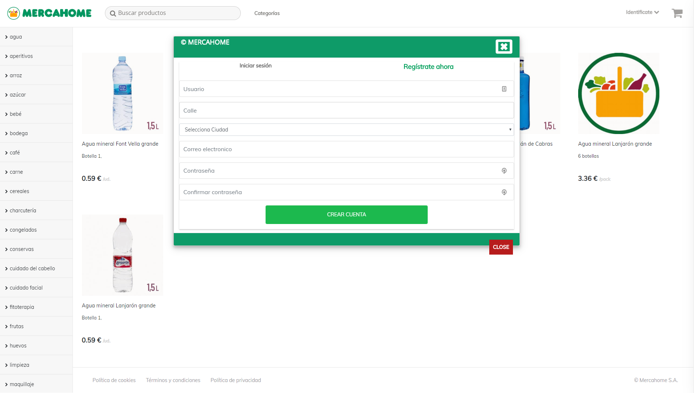

# Mercahome
> Frontend desarrollado en ReactJS que simula un modelo de negocio de venta de alimentación online.
> Es la parte frontend del proyecto MERCAHOME y trabaja junto con el backend [mercahomeAPI](https://github.com/perisdev/mercahomeAPI.git) 
## Screenshots

